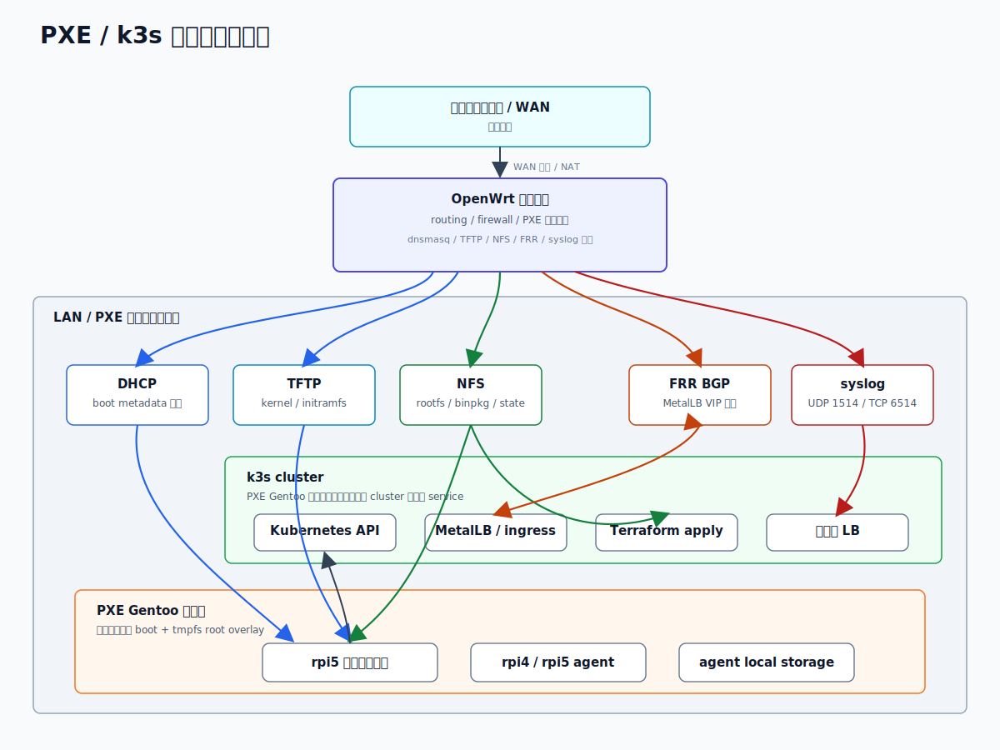
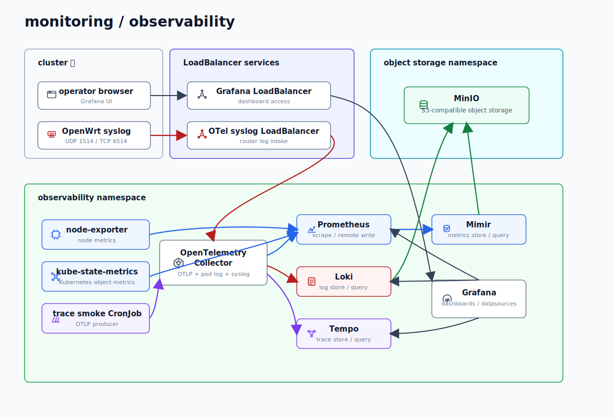
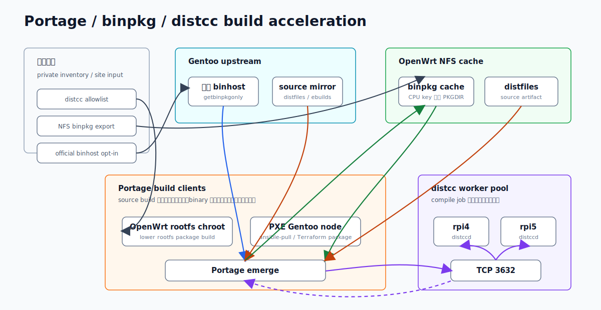

# homecluster-infra

[](https://github.com/tin-machine/homecluster-infra/actions/workflows/static-check.yml)

小規模 home lab 向けの OpenWrt / PXE Gentoo / k3s add-on infrastructure です。

この repository は、公開可能かつ実 site へも反映できる infrastructure 実装の subset です。
再利用できる設計判断、Ansible role、Terraform environment、example inventory、static check を置きます。private input を注入した後に実 site で使う実装を保つことを目的にしており、動作しない sample や skeleton にはしない方針です。

実 inventory、secret、Terraform state、kubeconfig、operation runbook、troubleshooting log、desktop workload、vendor payload はこの repository の外に置きます。

## 対象範囲

含めるもの:

- DHCP、DNS/TFTP、dnsmasq クエリログの opt-in、NFS rootfs、PXE client catalog、FRR、syslog、banIP opt-in、Prometheus exporter、wireless opt-in、sysupgrade detection の OpenWrt role。
- PXE Gentoo rootfs を作れる仕組み と Raspberry Pi network boot support。
- ARM64 Gentoo baseline と staging k3s server / agent configuration。
- CRD、common add-on、certificate、staging observability 用の Terraform post-bootstrap state。
- cluster infrastructure として使う local registry module。
- `docs/architecture-decision-record/` 配下の公開可能な ADR。

含めないもの:

- 実 inventory、host 名、address、serial、MAC address、password、token、kubeconfig。
- tfvars、Terraform state、SOPS recipient policy、raw log、private runbook。
- desktop 固有実装、scanner 固有実装、vendor installer。

## 境界

公開 repository は再利用可能な実装を定義します。site 固有値は、外部 inventory、Terraform root ごとの variable file、Helm chart ごとの values、local secret material から注入します。

staging local registry module は含めますが、public default では deploy しません。site-local LoadBalancer / PVC として使う場合は、private site input で明示的に有効化します。

## システム構成

現在は、OpenWrt が PXE boot と rootfs delivery を担当し、PXE Gentoo node 上に k3s staging cluster を構成します。実 host 名、address、secret はこの図に含めません。

### PXE / k3s runtime



SVG ソース: [docs/assets/pxe-k3s-runtime.svg](docs/assets/pxe-k3s-runtime.svg)

### monitoring / observability

staging の monitoring 系は Terraform `staging` root から作成され、`object-storage-stg` と `observability-stg` namespace に分かれます。サービス名は公開可能な release 名で、実 LoadBalancer address は外部入力です。



## Inventory

Ansible実行時の標準 inventory path は次としています。

```text
../inventory.yml
```

`../inventory.yml` は private inventory workflow から生成または配置する entrypoint です。同じ親 directory に複数の `homecluster-*` repository を置く場合でも、各 repository から同じ entrypoint を参照できる形を想定します。

公開用の syntax check と example では次を使います。

```bash
ansible-playbook --syntax-check -i examples/inventory.yml ansible/openwrt/site.yml
ANSIBLE_ROLES_PATH=ansible/arm64/roles:~/.ansible/roles:/usr/share/ansible/roles \
  ansible-playbook --syntax-check -i examples/inventory.yml ansible/arm64/site.yml
```

`examples/inventory.yml` は `192.0.2.0/24` の documentation address を使い、実 site 値を含みません。実 inventory はこの repository の外で管理し、必要に応じて `../inventory.yml` として生成、配置、または symlink します。

実 host に対して Ansible を実行する前に、private site-local inventory workflow で `../inventory.yml` を生成し、値を表示しない検証を通します。生成済み inventory、SOPS policy、recipient、key、復号済み値はこの repository へ commit しません。

inventory 保存方式の比較は [inventory storage options](docs/inventory-storage-options.md) を参照してください。

## OpenWrt live input

OpenWrt role は、実機へ書き込む site-specific value を外部 inventory から受け取ります。
LAN address、IPv6 ULA prefix、PXE / NFS / TFTP endpoint、FRR policy、syslog destination、dnsmasq クエリログ、banIP feed policy、storage device、backup share、distcc allowlist のような値は、暗黙 fallback しません。

public default は、`enabled: false`、empty list、empty string + assert などの no-op / fail-closed を基本にします。実機へ反映する場合は、対象 role を有効化する変数と実値を private inventory 側で明示してください。

PXE Gentoo rootfs の root SSH / password SSH は public default では有効にしません。closed lab の recovery-only 用途で必要な場合だけ、`openwrt_gentoo_ssh_allow_root_login` と `openwrt_gentoo_ssh_allow_password_auth` を external inventory で明示的に opt-in します。

詳細な外部入力は [外部入力](docs/site-input-contract.md) を参照してください。

## PXE Ansible Pull Branch

PXE client は site-local DHCP metadata から runtime `stage` を受け取ります。`ansible-pull` wrapper は、その stage を Git branch へ対応させます。

- `stg` / `staging` は `stg` branch を取得する。
- `prod` / `prd` / `production` は `main` branch を取得する。

未知の stage と、`main` / `stg` allowlist の外にある branch は fail closed します。branch を明示した場合でも、stage から導出した branch と一致する必要があります。wrapper は `main` へ黙って fallback しません。

## Terraform

Terraform state は environment ごとの外部入力です。state、tfvars、kubeconfig、generated plan は commit しません。
Terraform provider の schema によっては sensitive variable の値が state に残るため、state と plan は private secret material と同等に扱います。
Kubernetes Secret のような write-only attribute が使える箇所は `data_wo` と revision marker を優先し、新規 secret material を state に保持しない方針です。

site 固有 Terraform variable は documentation-value default を持ちません。staging root は、管理対象 chart すべてに対する generated site values directory と override file を要求します。site input が欠けている場合は、example value を silently apply せず plan が停止します。

初期公開 layout:

- `terraform/env/common-crds`
- `terraform/env/common-addons`
- `terraform/env/common-certificates`
- `terraform/env/staging`
- `terraform/env/production/README.md`

production は意図的に placeholder です。staging が最初の公開 example です。

よく使う local check:

```bash
terraform fmt -check -recursive
bash scripts/ci/static-check.sh
RUN_ANSIBLE_SYNTAX=1 RUN_ANSIBLE_LIST_TASKS=1 RUN_TERRAFORM_VALIDATE=1 \
  bash scripts/ci/static-check.sh
STATIC_CHECK_STRICT_LOCAL=1 bash scripts/ci/static-check.sh
```

opt-in の Terraform validation は `-backend=false` で provider を初期化し、repository 外の一時 data directory を使います。site-local state や kubeconfig を使わず configuration を validate します。live `terraform plan` / `apply` には site-local state、kubeconfig、外部 variable が必要なので、public static check の default には含めません。

既定の static check は、tracked file と untracked non-ignored file を対象にします。`.terraform/`、`*.tfstate`、`*.tfvars`、secret manifest、private key はこの対象に入った時点で failure です。`terraform/` と `clusters/` は追加で Terraform / Helm values 向けの private address、IPv6 ULA、cloud token、Slack token、GitHub token、email-like value scan を通します。`STATIC_CHECK_STRICT_LOCAL=1` を付けると ignored file も含む worktree 全体を scan し、公開前に `.terraform/` cache や生成物が残っていないことを確認できます。

実 site へ使う前の確認は [full execution validation](docs/full-execution-validation.md) を参照してください。Terraform root 固有入力と Helm chart 固有入力の形式は [外部入力](docs/site-input-contract.md) を参照してください。

## Secret

secret は外部入力です。

- `.sops.yaml`、復号済み file、tfvars、kubeconfig、private key、token、password file、secret を含む generated manifest は commit しません。
- SOPS / Vault / Ansible Vault policy は、private inventory と local operator workflow 側で管理します。
- k3s bootstrap helper が生成する runtime token は runtime artifact であり、repository content ではありません。

## CI 境界

public CI は static check に限定します。

- redaction pattern scan。
- hard-exclude file scan。
- trailing whitespace scan。
- Terraform が使える場合の formatting check。
- Python が使える場合の local filter plugin syntax check。
- opt-in の backend-free Terraform validation。
- opt-in の Ansible syntax check と static task listing。

public CI は `terraform apply` を実行せず、LAN host に対して Ansible を実行せず、repository secret を使わず、self-hosted runner も使いません。

## Build acceleration

PXE Gentoo の build acceleration は、runtime 構成とは別に Portage の package build path として扱います。公式 Gentoo binhost は明示 opt-in した package だけ `--getbinpkgonly` で使い、source build の成果物は OpenWrt NFS 上の CPU key 付き binpkg cache へ残します。distcc は受け側の `distccd` が enabled / active / listen 済みであることを確認できる場合だけ、compile job の分散先として扱います。



## ドキュメント

- [docs/README.md](docs/README.md): ドキュメント索引。
- [docs/publication-readiness-gate.md](docs/publication-readiness-gate.md): repository visibility 変更前の最終確認。
- [docs/inventory-storage-options.md](docs/inventory-storage-options.md): inventory 保存方式の比較。
- [docs/architecture-decision-record/](docs/architecture-decision-record/): 公開可能な設計判断。
- [examples/inventory.yml](examples/inventory.yml): 公開用 inventory 形状。

## License

この repository は Apache License, Version 2.0 で license されます。詳細は `LICENSE` を参照してください。

第三者由来の Grafana dashboard JSON の出典とライセンス表記は `NOTICE` に記載します。
